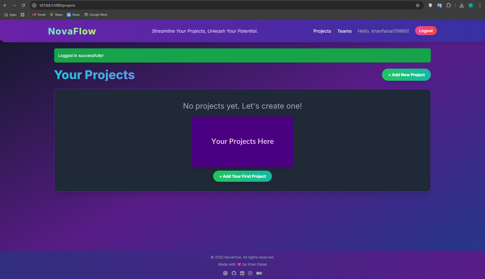
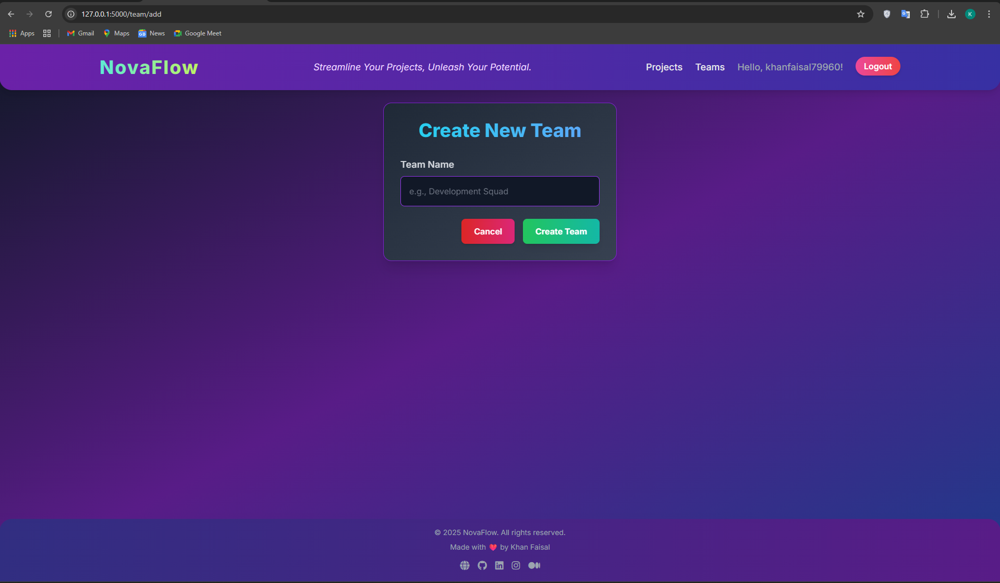
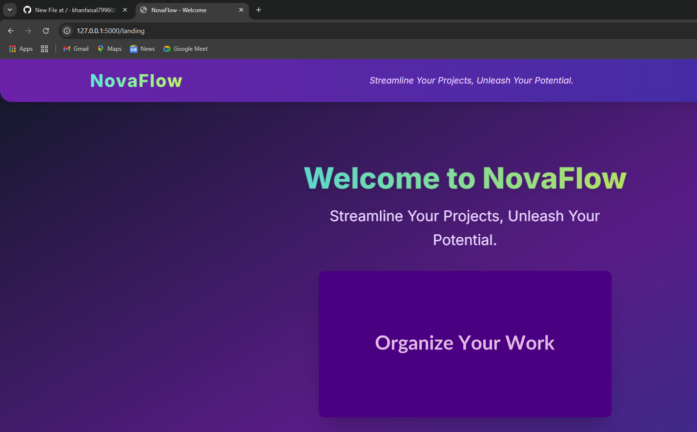
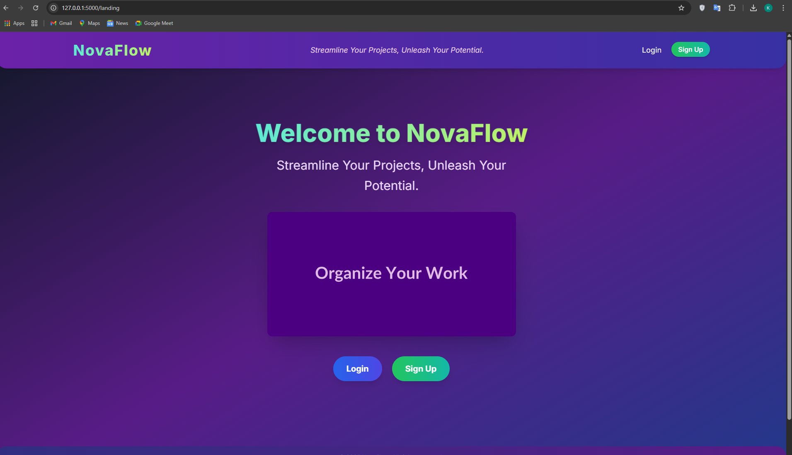

# 🎓 NovaFlow — Streamline Your Projects, Unleash Your Potential


**NovaFlow** is a lightweight, web-based project management tool built with **Flask**. It helps individuals and small teams organize their projects and tasks efficiently with a clean, intuitive interface and powerful collaboration features.

---

## 🌐 Live Demo

👉 [**View Live Demo**](https://nova-flow-flame.vercel.app/)

---

## 🔥 Features

- 🔐 **User Authentication**: Secure sign-up and login/logout flow.
- 📁 **Project Management**: Create, update, track, and delete projects.
- ✅ **Task Management**: Assign, complete, and manage tasks with progress tracking.
- 👥 **Team Collaboration**: Create/join teams with unique IDs and manage team-based projects.
- 📝 **Markdown Support**: Write beautifully formatted descriptions using markdown.
- 📱 **Fully Responsive**: Built with Tailwind CSS for a mobile-friendly experience.
- ❌ **Custom 404 Page**: Friendly UX for broken or invalid routes.

---

## 📸 Project Screenshots

| Dashboard | Teams | Projects | Tasks | 404 Page |
|----------|-------|----------|-------|----------|
|  |  |  |  |  |

---

## 🧠 How it Works

- Users register and join teams using unique Team IDs.
- Each project can be assigned a status: `Not Started`, `Planning`, `In Progress`, etc.
- Tasks belong to projects and reflect their team association.
- Descriptions use Markdown for rich formatting.
- A simple local database (JSON or SQLite) manages all data in development.

---

## 🛠️ Tech Stack

- **Backend**: Flask (Python)
- **Frontend**: Tailwind CSS, HTML, Jinja2
- **Auth & Logic**: Werkzeug, Markdown
- **Extras**: Font Awesome, Markdown-it

---

## 🚀 Getting Started

```bash
git clone https://github.com/your-username/NovaFlow.git
cd NovaFlow
python -m venv venv
source venv/bin/activate  # or .\venv\Scripts\activate on Windows
pip install -r requirements.txt
python app.py
```

Now open your browser and visit: [http://127.0.0.1:5000/](http://127.0.0.1:5000/)

> 💡 Remove `_initialize_test_data()` from `app.py` before production deployment.

---

## 🙋‍♂️ Author

**Faisal Khan**

- 🌐 [Portfolio](https://khanfaisal.netlify.app)
- 💼 [LinkedIn](https://www.linkedin.com/in/khanfaisal79960)
- ✍️ [Medium](https://medium.com/@khanfaisal79960)
- 📸 [Instagram](https://instagram.com/mr._perfect_1004)
- 💻 [GitHub](https://github.com/khanfaisal79960)

---
